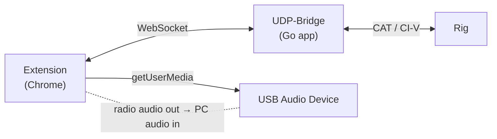

# Ham Radio Recorder 🎙

**[日本語版 (README.md)](README.md)**

Chrome Extension (MV3) for scheduled radio monitoring and recording.  
Controls your rig via CAT/CI-V commands over WebSocket ([UDP-Bridge](https://github.com/itcom/udp-bridge)) and records received audio automatically.

---

## Features

- **Per-Schedule Rig Control** — Each schedule defines its own frequency, mode, and recording window
- **Scheduled Recording** — Daily repeating or one-shot alarms via `chrome.alarms`
- **Audio Recording** — Records from USB audio input using `MediaRecorder` (WebM/Opus)
- **Offscreen Recording** — Uses Chrome's Offscreen Document API (MV3 compliant)
- **Inline Editing** — Edit any schedule's parameters directly from the Options page
- **Manual Trigger** — Test any schedule with the ▶ Run button without waiting for the alarm
- **Status Popup** — Real-time recording status, progress bar, and activity log

---

## How It Works



1. When a schedule's alarm fires, the extension connects to UDP-Bridge via WebSocket
2. Sends `setFreq` and `setMode` commands to tune the rig
3. Opens an offscreen document and starts recording from the selected USB audio device
4. Records for the duration defined by start/end time, then saves as `.webm`

---

## Architecture

| Component        | File                              | Role                                     |
| ---------------- | --------------------------------- | ---------------------------------------- |
| Service Worker   | `background/index.ts`             | Alarms, WS commands, orchestration       |
| Message Handlers | `background/messages/*.ts`        | Popup/Options → SW communication         |
| Offscreen        | `offscreen.html` + `offscreen.ts` | Audio recording engine                   |
| Popup            | `popup.tsx`                       | Status display, stop/reset controls      |
| Options          | `options.tsx`                     | Schedule management, connection settings |
| Libraries        | `lib/`                            | WebSocket client, storage helpers, types |

---

## Prerequisites

- [UDP-Bridge](https://github.com/itcom/udp-bridge) running locally (default: `ws://127.0.0.1:17800/ws`)
- USB audio device connected (radio audio output → PC audio input)
- Google Chrome (v116+ for Offscreen API support)

---

## Getting Started

### 1. Install from Release (recommended)

1. Download the latest `.zip` from [Releases](https://github.com/itcom/ham-radio-recorder/releases)
2. Extract the zip to a folder
3. Open `chrome://extensions`
4. Enable **Developer mode** (toggle in top right)
5. Click **Load unpacked**
6. Select the extracted folder

### 2. Build from Source (for developers)

- [Node.js](https://nodejs.org/) v18+
- [Yarn](https://yarnpkg.com/) or npm

```bash
# Install dependencies
yarn install

# Development (with hot reload)
yarn dev

# Production build
yarn build
```

After building, load the extension:

1. Open `chrome://extensions`
2. Enable **Developer mode** (toggle in top right)
3. Click **Load unpacked**
4. Select `build/chrome-mv3-dev` (development) or `build/chrome-mv3-prod` (production)

### 3. Grant Permissions

On the Options page:
1. Click **🔓 Grant Mic** to allow microphone access
2. Click **🔄 Refresh Devices** to list available audio inputs
3. Select your USB audio device from the dropdown

---

## Usage

### Setting Up a Recording Schedule

1. Open the extension **Options** page (right-click extension icon → Options)
2. In the **⏰ Recording Schedules** section, fill in:

| Field | Description                              | Example   |
| ----- | ---------------------------------------- | --------- |
| Start | Recording start time (HH:MM)             | `07:00`   |
| End   | Recording end time (HH:MM)               | `07:30`   |
| Freq  | Frequency in MHz                         | `145.500` |
| Mode  | Operating mode                           | `FM`      |
| Data  | Data mode checkbox                       | unchecked |
| Type  | `Daily` (repeating) or `One-shot` (once) | `Daily`   |

3. Click **+ Add Schedule**

> **Note:** Duration is automatically calculated from start/end time. Cross-midnight schedules are supported (e.g., 23:30 → 00:15 = 45 min).

### Managing Schedules

| Action             | How                                        |
| ------------------ | ------------------------------------------ |
| **Enable/Disable** | Toggle the checkbox on the left            |
| **Edit**           | Click ✏ to open inline editor, then ✓ Save |
| **Manual Test**    | Click ▶ Run to start recording immediately |
| **Delete**         | Click ✕ to remove                          |

- **Daily** schedules repeat every day at the specified time
- **One-shot** schedules are automatically deleted after their alarm fires
- **▶ Run** is for testing — it does not affect the schedule's enabled state

### Connection Settings

Configure the WebSocket connection to UDP-Bridge:

| Setting  | Default     | Description            |
| -------- | ----------- | ---------------------- |
| Host     | `127.0.0.1` | UDP-Bridge host        |
| Port     | `17800`     | UDP-Bridge port        |
| Path     | `/ws`       | WebSocket path         |
| Rig Port | `0`         | Rig port (0 = default) |

Click **🔌 Test Connection** to verify connectivity.

### Filename Template

Customize recording filenames using placeholders:

| Placeholder | Replaced with           | Example     |
| ----------- | ----------------------- | ----------- |
| `{date}`    | Date in YYYYMMDD format | `20260221`  |
| `{time}`    | Time in HHMMSS format   | `070000`    |
| `{freq}`    | Frequency in Hz         | `145500000` |
| `{mode}`    | Operating mode          | `FM`        |

Default template: `{date}_{time}_{freq}_{mode}`  
Example output: `20260221_070000_145500000_FM.webm`

### Popup

The popup shows:
- Current recording state and progress
- Next scheduled alarm time
- Recent activity log
- **◼ Stop** button (during recording) or **↺ Reset** (on error)

---

## UDP-Bridge Protocol

The extension communicates with UDP-Bridge using JSON over WebSocket:

```jsonc
// Set frequency
→ {"type":"setFreq","port":0,"freq":145500000}
← {"type":"setFreqResult","success":true}

// Set mode
→ {"type":"setMode","port":0,"mode":"FM","data":false}
← {"type":"setModeResult","success":true}
```

---

## Troubleshooting

| Problem                    | Solution                                                                   |
| -------------------------- | -------------------------------------------------------------------------- |
| No audio devices listed    | Click **🔓 Grant Mic** first, then **🔄 Refresh Devices**                    |
| WebSocket connection fails | Ensure UDP-Bridge is running and check host/port settings                  |
| Recording doesn't start    | Check Chrome developer tools console for the service worker                |
| Alarm doesn't fire         | Chrome may throttle alarms; ensure the extension is enabled                |
| Recording cuts off early   | The backup stop alarm fires if the offscreen document becomes unresponsive |

---

## Development

```bash
# Dev server with hot reload
yarn dev

# Production build
yarn build

# The build script also runs:
# 1. plasmo build
# 2. scripts/inline-chunks.mjs (inlines code-split chunks for SW compatibility)
# 3. Copies offscreen.html to build output
```

---

## License

MIT
