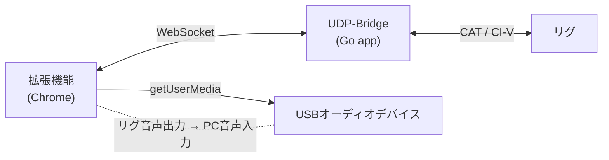

# Ham Radio Recorder 🎙

**[English version (README.md)](README.md)**

アマチュア無線の受信音声をスケジュール録音するChrome拡張機能（MV3）です。  
WebSocket経由で[UDP-Bridge](https://github.com/itcom/udp-bridge)を通じてCAT/CI-Vコマンドを送り、リグの周波数・モードを自動制御して録音します。

---

## 特徴

- **スケジュールごとのリグ制御** — スケジュールごとに周波数・モード・録音時間を設定
- **スケジュール録音** — Daily（毎日繰り返し）またはOne-shot（1回限り）
- **音声録音** — USBオーディオ入力からMediaRecorderで録音（WebM/Opus形式）
- **オフスクリーン録音** — ChromeのOffscreen Document APIを使用（MV3準拠）
- **インライン編集** — Options画面から直接スケジュールを編集
- **手動テスト実行** — ▶ Runボタンでアラームを待たずに即座にテスト録音
- **ステータスポップアップ** — 録音状態、プログレスバー、アクティビティログ表示

---

## 動作の仕組み



1. スケジュールのアラームが発火すると、WebSocket経由でUDP-Bridgeに接続
2. `setFreq`・`setMode`コマンドを送信してリグを制御
3. オフスクリーンドキュメントを開き、USBオーディオデバイスから録音開始
4. 開始時刻〜終了時刻の長さで録音し、`.webm`ファイルとして保存

---

## アーキテクチャ

| コンポーネント     | ファイル                          | 役割                                           |
| ------------------ | --------------------------------- | ---------------------------------------------- |
| Service Worker     | `background/index.ts`             | アラーム管理、WSコマンド、オーケストレーション |
| メッセージハンドラ | `background/messages/*.ts`        | Popup/Options → SW間通信                       |
| オフスクリーン     | `offscreen.html` + `offscreen.ts` | 音声録音エンジン                               |
| ポップアップ       | `popup.tsx`                       | ステータス表示、停止/リセット操作              |
| 設定画面           | `options.tsx`                     | スケジュール管理、接続設定                     |
| ライブラリ         | `lib/`                            | WebSocketクライアント、ストレージ、型定義      |

---

## 必要なもの

- [Node.js](https://nodejs.org/) v18以上
- [Yarn](https://yarnpkg.com/) または npm
- [UDP-Bridge](https://github.com/itcom/udp-bridge) をローカルで実行（デフォルト: `ws://127.0.0.1:17800/ws`）
- USBオーディオデバイス（リグの音声出力をPCに入力）
- Google Chrome（v116以上、Offscreen API対応）

---

## セットアップ

### 1. インストール＆ビルド

```bash
# 依存関係のインストール
yarn install

# 開発サーバー（ホットリロード付き）
yarn dev

# プロダクションビルド
yarn build
```

### 2. Chromeに読み込み

1. `chrome://extensions` を開く
2. 右上の **デベロッパーモード** を有効化
3. **パッケージ化されていない拡張機能を読み込む** をクリック
4. `build/chrome-mv3-dev`（開発用）または `build/chrome-mv3-prod`（本番用）を選択

### 3. 権限の付与

Options画面で:
1. **🔓 Grant Mic** をクリックしてマイクのアクセスを許可
2. **🔄 Refresh Devices** をクリックしてオーディオ入力デバイスの一覧を取得
3. ドロップダウンからUSBオーディオデバイスを選択

---

## 使い方

### 録音スケジュールの設定

1. 拡張機能の **Options** 画面を開く（拡張機能アイコンを右クリック → オプション）
2. **⏰ Recording Schedules** セクションで以下を入力:

| 項目  | 説明                                        | 例        |
| ----- | ------------------------------------------- | --------- |
| Start | 録音開始時刻（HH:MM）                       | `07:00`   |
| End   | 録音終了時刻（HH:MM）                       | `07:30`   |
| Freq  | 周波数（MHz単位）                           | `145.500` |
| Mode  | 運用モード                                  | `FM`      |
| Data  | データモード チェックボックス               | OFF       |
| Type  | `Daily`（毎日）または `One-shot`（1回限り） | `Daily`   |

3. **+ Add Schedule** をクリック

> **注意:** 録音時間はStart/Endから自動計算されます。深夜をまたぐスケジュールにも対応しています（例: 23:30 → 00:15 = 45分）。

### スケジュールの管理

| 操作              | 方法                                         |
| ----------------- | -------------------------------------------- |
| **有効/無効切替** | 左のチェックボックスを切り替え               |
| **編集**          | ✏ をクリックしてインライン編集、✓ Saveで保存 |
| **手動テスト**    | ▶ Run をクリックして即座に録音開始           |
| **削除**          | ✕ をクリックして削除                         |

- **Daily** スケジュールは毎日指定された時刻に繰り返し実行
- **One-shot** スケジュールはアラーム実行後に自動削除
- **▶ Run** はテスト用 — スケジュールの有効状態は変更されません

### 接続設定

UDP-BridgeへのWebSocket接続を設定:

| 設定項目 | デフォルト  | 説明                         |
| -------- | ----------- | ---------------------------- |
| Host     | `127.0.0.1` | UDP-Bridgeのホスト           |
| Port     | `17800`     | UDP-Bridgeのポート           |
| Path     | `/ws`       | WebSocketのパス              |
| Rig Port | `0`         | リグのポート（0=デフォルト） |

**🔌 Test Connection** をクリックして接続を確認できます。

### ファイル名テンプレート

プレースホルダーを使って録音ファイル名をカスタマイズ:

| プレースホルダー | 置換内容           | 例          |
| ---------------- | ------------------ | ----------- |
| `{date}`         | YYYYMMDD形式の日付 | `20260221`  |
| `{time}`         | HHMMSS形式の時刻   | `070000`    |
| `{freq}`         | 周波数（Hz）       | `145500000` |
| `{mode}`         | 運用モード         | `FM`        |

デフォルト: `{date}_{time}_{freq}_{mode}`  
出力例: `20260221_070000_145500000_FM.webm`

### ポップアップ

ポップアップには以下が表示されます:
- 録音状態とプログレスバー
- 次回スケジュールのアラーム時刻
- 最近のアクティビティログ
- **◼ Stop** ボタン（録音中）または **↺ Reset** ボタン（エラー時）

---

## UDP-Bridgeプロトコル

WebSocket経由でJSON形式のコマンドを送受信します:

```jsonc
// 周波数設定
→ {"type":"setFreq","port":0,"freq":145500000}
← {"type":"setFreqResult","success":true}

// モード設定
→ {"type":"setMode","port":0,"mode":"FM","data":false}
← {"type":"setModeResult","success":true}
```

---

## トラブルシューティング

| 問題                             | 対処法                                                                         |
| -------------------------------- | ------------------------------------------------------------------------------ |
| オーディオデバイスが表示されない | **🔓 Grant Mic** を先にクリックしてから **🔄 Refresh Devices**                   |
| WebSocket接続失敗                | UDP-Bridgeが起動しているか確認し、ホスト/ポート設定を確認                      |
| 録音が開始されない               | Chromeの開発者ツールでService Workerのコンソールを確認                         |
| アラームが発火しない             | Chromeがアラームを制限する場合があります。拡張機能が有効か確認                 |
| 録音が途中で切れる               | オフスクリーンドキュメントが無応答の場合、バックアップ停止アラームが発火します |

---

## 開発

```bash
# ホットリロード付き開発サーバー
yarn dev

# プロダクションビルド
yarn build

# ビルドスクリプトの処理内容:
# 1. plasmo build
# 2. scripts/inline-chunks.mjs（SW互換のためコード分割チャンクをインライン化）
# 3. offscreen.htmlをビルド出力にコピー
```

---

## ライセンス

MIT
